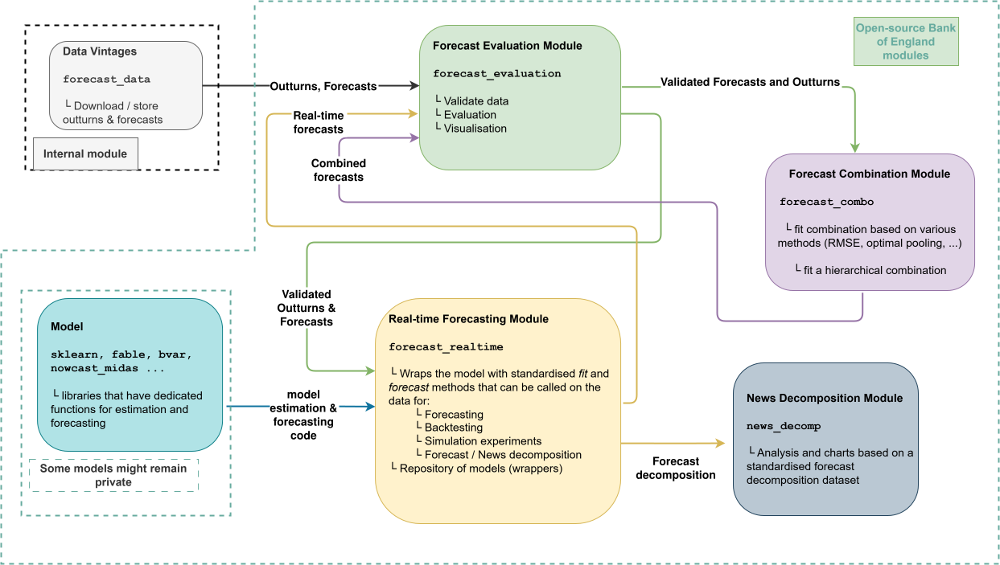

# OPERA: Open-Source Prediction Evaluation and Real-Time Analysis

OPERA is a modular ecosystem designed to support the use of time-series models in real-time settings and foster open collaboration. It comprises the following modules:

- [`opera-eco`](https://github.com/bank-of-england/opera-eco) pins compatible releases and supplies documentation, AI skills, and integration tests.
- [`forecast_evaluation`](https://github.com/bank-of-england/forecast_evaluation) validates vintaged outturns and forecasts and provides evaluation and visualisation capabilities.
- [`forecast_realtime`](https://github.com/bank-of-england/forecast-realtime) runs models across data vintages.
- [`forecast_combo`](https://github.com/bank-of-england/forecast-combo) combines forecasts through averaging, regression, error-based weighting, or hierarchies.
- [`news_decomp`](https://github.com/bank-of-england/news-decomp) attributes nowcast levels and revisions to news, re-estimation, and interaction.

OPERA supports a broad range of models through wrappers for libraries such as scikit-learn and R's fable. You can also [add your own model](https://bank-of-england.github.io/opera-eco/guide/adding_a_model/). In addition to these wrappers, OPERA includes models with native support:

- [`bvar`](https://github.com/bank-of-england/bvar) provides tools for working with Bayesian VARs.
- [`nowcast-midas`](https://github.com/bank-of-england/nowcast-midas) nowcasts quarterly targets from higher-frequency indicators using MIDAS and combination techniques.

## Licence and copyright

This project is released under the [MIT Licence](https://opensource.org/license/mit/).

Copyright (c) 2026 Bank of England.

The full licence text is available in the repository's [LICENSE file](https://github.com/bank-of-england/forecast-combo/blob/main/LICENSE).
